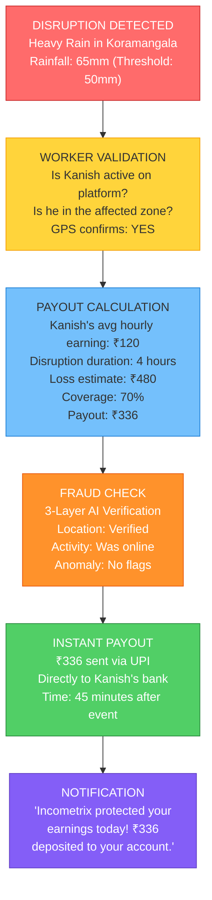
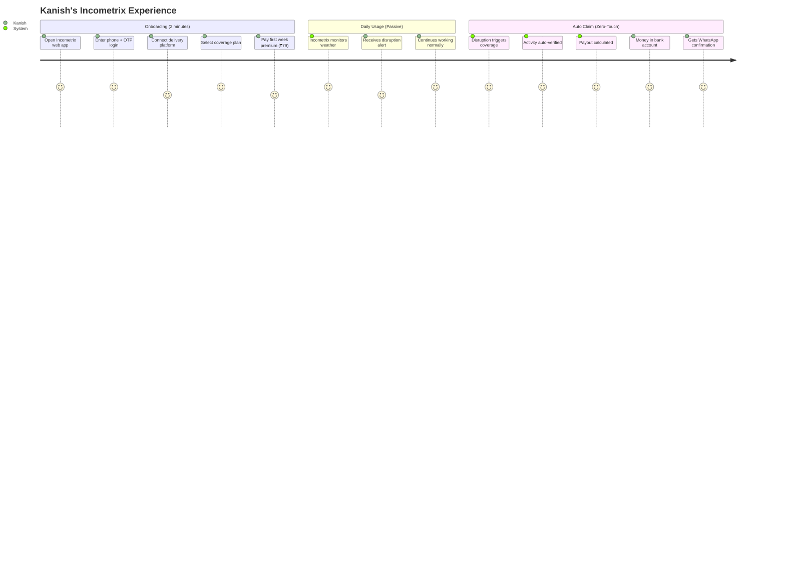
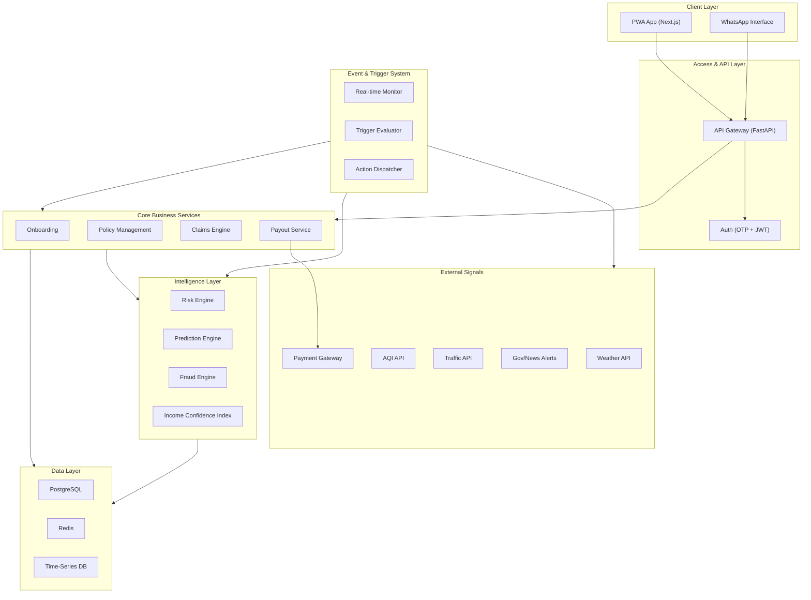
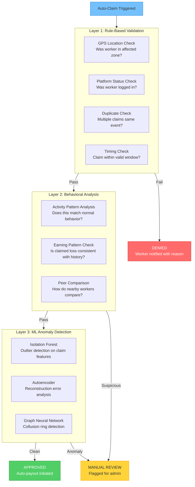

<div align="center">

# 💰 Incometrix AI

### **Predict. Protect. Pay.**

### *AI-Powered Income Intelligence & Protection for India’s Gig Workforce*

**Guidewire DEVTrails 2026**

**Team name: Xplosion**

</div>

---

## 📌 The Problem

India's platform-based delivery partners — working for Zomato, Swiggy, Zepto, Amazon, and others — are the backbone of the ₹5.5 trillion digital commerce economy. Yet they remain financially invisible.

### The Income Vulnerability Crisis

| Disruption | Frequency | Income Impact |
|---|---|---|
| Heavy Monsoon Rains | ~90 days/year | Deliveries halted entirely |
| Extreme Heatwaves (>45°C) | ~30 days/year | Health risk, reduced hours |
| Severe Pollution (AQI >400) | ~40 days/year in Delhi NCR | Advisory to stay indoors |
| Curfews & Bandhs | Unpredictable | Complete work stoppage |
| Platform Outages | Occasional | No orders received |

**A typical food delivery partner earns ₹15,000–₹25,000/month.** When disruptions hit, they lose **20–30% of monthly income** — with zero safety net.

> **The cruel irony:** The workers who power India's convenience economy have no protection when inconvenience strikes *them*.

### Why Traditional Insurance Fails Gig Workers

- **Monthly/yearly premiums** don't match weekly pay cycles
- **Manual claim filing** — workers don't have time or knowledge
- **Slow processing** — weeks to months for payouts
- **Rigid plans** — one-size-fits-all doesn't work for gig economy
- **Trust deficit** — "insurance never pays out"
---
## 🚀 Incometrix AI — The Solution

**Incometrix AI** is a fully automated, AI-powered parametric income protection platform designed exclusively for India's gig delivery workers.

### What Makes Incometrix Different

| Feature | Traditional Insurance | Other Hackathon Teams | **Incometrix AI** |
|---|---|---|---|
| Claim Process | Manual paperwork | Basic automation | **Zero-Touch™ — Fully automatic** |
| Pricing | Fixed monthly | Simple weekly | **AI-Dynamic Weekly, per-worker** |
| Risk Assessment | Age/gender tables | Basic ML | **Hyperlocal Risk Microgrids™** |
| Fraud Detection | Manual review | Rule-based | **3-Layer AI Fraud Shield** |
| Worker Experience | File & wait | Claim button | **Nothing to do — it just works** |
| Intelligence | None | Basic predictions | **Predictive Disruption Engine + Earning Simulation** |

### 💎 Three Breakthrough Innovations

#### 1. Income Stability Score (ISS) — *The "Credit Score" for Gig Income*

Every worker gets a dynamic **Income Stability Score (0–100)** that reflects their income resilience and reliability:

```
ISS = f(earning_consistency, work_regularity, zone_risk, disruption_history, platform_rating)
```

**How it works:**
- **Built over time** — like a credit score, ISS improves as the worker maintains consistent activity
- **Reduces premiums** — higher ISS = lower weekly premiums (rewarding reliability)
- **Increases coverage** — proven track record unlocks higher payout limits
- **Portable** — workers can use their ISS across platforms (future: financial credit)

**Why it's breakthrough:** No one in Indian InsurTech has created a gig-specific behavioral score. This becomes a financial identity layer for the unorganized workforce — a potential billion-dollar data asset.

#### 2. Hyperlocal Risk Microgrids™ — *1km² Precision Risk Mapping*

Instead of city-level risk assessment (the industry default), Incometrix divides cities into **1km² risk microgrids**:

```
City: Mumbai → 603 km² → 603 microgrids
Each microgrid gets its own:
  ├── Flood risk score (drainage data + elevation + rainfall history)
  ├── Heat risk index (urban heat island mapping)
  ├── Pollution exposure (nearest AQI station interpolation)
  ├── Traffic disruption probability (historical congestion data)
  └── Social disruption risk (protest/bandh history)
```

**Why it's breakthrough:** A worker in Mumbai's Bandra (flood-prone) pays a different premium than a worker in Powai (elevated terrain) — even though they're in the same city. This is **insurance underwriting precision that traditional insurers don't offer** for this segment.

#### 3. Predictive Disruption Engine — *Know Before It Hits*

Incometrix doesn't just react to disruptions — it **predicts them 24–48 hours in advance**:

```
Tomorrow's Forecast for Your Zone:
┌──────────────────────────────────────┐
│  HIGH DISRUPTION RISK (78%)          │
│                                      │
│  Heavy rain expected: 4PM–10PM       │
│  Predicted earning drop: ₹350–₹500   │
│  Your coverage: ACTIVE (₹400 max)    │
│                                      │
│  Tip: Complete maximum orders before │
│  4PM to maximize today's earnings    │
│                                      │
│  [View Disruption Details]           │
└──────────────────────────────────────┘
```

**What this enables:**
- Workers can **plan their day** around predicted disruptions
- Platform can **pre-position** delivery capacity
- Incometrix **pre-validates** workers before the event (reducing fraud)
- Builds **massive trust** — "Incometrix told me about the rain before it happened"

## Phase 2 Runbook

### Backend setup

1. Create `backend/.env` with Supabase, Redis, and optional weather/AQI keys.
2. Run the schema in `backend/scripts/init_schema.sql`.
3. Run `backend/scripts/live_pricing_schema.sql`.
4. Bootstrap the top-20 city registry, microgrids, and active pricing config:

```bash
cd backend
python scripts/bootstrap_live_pricing.py
```

5. Populate grid polygons and PostGIS lookup with `backend/scripts/populate_microgrid_polygons.sql`.
6. Refresh live pricing features:

```bash
cd backend
python scripts/refresh_live_features.py
```

9. Run the Phase 3 schema for Telegram notification linking and delivery logs:

```bash
backend/scripts/phase3_schema.sql
```

7. Seed plans and multi-city microgrids if you still need the legacy bootstrap:

```bash
cd backend
python scripts/seed_db.py
```

8. Start the API:

```bash
uvicorn app.main:app --reload
```

### Frontend setup

```bash
cd frontend
npm install
npm run dev
```

### Demo flow

1. Register a worker with OTP, onboarding, and city-aware location lookup.
2. Pick a plan and confirm the dynamic weekly premium breakdown from live city/grid features.
3. Open the worker dashboard to verify the live protection banner and policy state.
4. Open `/admin/claims` and use `Simulate Disruption` for:
   - `heavy_rainfall`
   - `extreme_heat`
   - `severe_aqi`
   - `flood_alert`
   - `platform_outage` (demo-simulated only)
5. Show one auto-paid claim and one flagged claim that is reviewed from the admin flow.
6. Optionally link a Telegram chat id for worker/admin notifications and send a test alert.

## Phase 3 Additions

- Telegram bot alerts for worker and admin notifications
- Predictive disruption analytics for the next 24–48 hours
- UPI-style simulated payout receipts and payout audit timelines
- Expanded admin analytics for loss ratio, payout summary, and next-week liability
- Demo artefacts in `docs/phase3_demo_flow.md` and `docs/final_pitch_outline.md`

---

# 👤 Deep Persona Intelligence

Instead of a single generic user, we model **3 behavioral archetypes**:

| Persona        | Behavior        | Risk Profile | Income Pattern |
| -------------- | --------------- | ------------ | -------------- |
|  Hustler     | Works 10–12 hrs | High         | Volatile       |
|  Stabilizer  | Fixed schedule  | Medium       | Predictable    |
|  Opportunist | Peak hours only | High         | Burst-based    |

**Impact:**

* Personalized pricing
* Behavioral fraud detection
* Accurate income prediction

## Target Persona: Food Delivery Partners

### Why Food Delivery?

| Factor | Food Delivery | E-Commerce | Quick Commerce |
|---|---|---|---|
| Weather sensitivity | 🔴 Extreme | 🟡 Moderate | 🔴 High |
| Daily earning dependency | 🔴 100% daily | 🟡 Shift-based | 🔴 100% daily |
| Workers in India | ~5M+ | ~1M | ~500K |
| Data availability | 🟢 Rich | 🟡 Moderate | 🟡 Growing |

### Meet Kanish — Our Primary Persona

> **Kanish**, 26, delivers for Zomato in Bengaluru. He works 10–12 hours daily, completing 18–25 deliveries across Koramangala and HSR Layout. He earns ₹800–₹1,200/day (₹5,000–₹7,500/week). During last monsoon, he lost 8 working days in one month — costing him ₹8,000+ in lost income. He couldn't pay his bike EMI that month.

### Kanish's Daily Workflow

```
┌─────────────────────────────────────────────────────┐
│  KANISH'S TYPICAL DAY                               │
├─────────────────────────────────────────────────────┤
│                                                     │
│  7:00 AM    Login to Zomato platform                │
│  7:30 AM    Start accepting orders                  │
│ 11:00 AM    Peak lunch rush (5–8 deliveries)        │
│  1:00 PM    Short break                             │
│  2:00 PM    Afternoon orders (3–5 deliveries)       │
│  5:00 PM    RAIN STARTS — orders dry up             │
│  5:30 PM    Sitting idle, no income, still online   │
│  8:00 PM    Tries evening shift — roads flooded     │
│  9:00 PM    Goes home — lost ₹400+ in potential     │
│             earnings for the evening                │
│                                                     │
│  WITHOUT Incometrix: Lost ₹400, no compensation     │
│  WITH Incometrix: ₹320 auto-deposited at 10 PM      │
│                                                     │
└─────────────────────────────────────────────────────┘
```

### Persona Income Pattern

| Metric | Value |
|---|---|
| Daily earnings | ₹800–₹1,200 |
| Weekly earnings | ₹5,000–₹7,500 |
| Peak hours | 11AM–2PM, 7PM–10PM |
| Deliveries/day | 18–25 |
| Avg delivery payout | ₹40–₹55 |
| Monthly disruption days | 4–8 days |
| Monthly income loss | ₹3,200–₹9,600 |

---

##  How It Works

### The Zero-Touch™ Claim Flow

Incometrix's defining feature: **workers never file a claim.** The entire process is automated, parametric, and instant.



### Complete User Journey



---
## 🏗️ System Architecture


### High-Level Architecture


### Microservice Breakdown

| Service | Responsibility | Key Endpoints |
|---|---|---|
| **Auth Service** | OTP login, JWT tokens, session management | `POST /auth/otp`, `POST /auth/verify` |
| **Onboarding Service** | Worker registration, platform linking, KYC | `POST /workers/register`, `POST /workers/link-platform` |
| **Policy Service** | Plan creation, premium calculation, renewal | `GET /plans`, `POST /policies/subscribe`, `PUT /policies/renew` |
| **Claims Service** | Auto-claim creation, validation, processing | `POST /claims/auto-trigger`, `GET /claims/{id}` |
| **Payout Service** | Payment processing, UPI integration | `POST /payouts/initiate`, `GET /payouts/status` |
| **Risk Engine** | ISS calculation, zone risk, premium pricing | `GET /risk/score/{worker_id}`, `GET /risk/zone/{grid_id}` |
| **Fraud Engine** | Multi-layer fraud validation | `POST /fraud/validate`, `GET /fraud/report` |
| **Trigger Engine** | Real-time monitoring, event detection | WebSocket `/ws/triggers`, `GET /triggers/active` |
| **Prediction Engine** | Disruption forecasting, earning simulation | `GET /predict/disruption/{zone}`, `GET /predict/earnings` |

---
## 🎯 Parametric Triggers

### Trigger Definitions

Every trigger follows the **DETECT → VALIDATE → PAY** paradigm. No human intervention required.

| # | Trigger | Data Source | Condition | Payout Range | Response Time |
|---|---|---|---|---|---|
| 1 |  **Heavy Rainfall** | OpenWeatherMap | Rainfall > 50mm in 6h | ₹200–₹500/event | 30–60 min |
| 2 |  **Extreme Heat** | OpenWeatherMap | Temperature > 44°C | ₹150–₹400/event | 30–60 min |
| 3 |  **Severe Pollution** | AQICN API | AQI > 400 (Hazardous) | ₹150–₹350/event | 1–2 hours |
| 4 |  **Flood Alert** | IMD + OpenWeatherMap | Official flood warning OR rainfall > 100mm/24h | ₹400–₹700/event | 1–2 hours |
| 5 |  **Curfew/Bandh** | News API + Gov Alerts | Official curfew announcement for zone | ₹300–₹600/event | 2–4 hours |
| 6 |  **Platform Outage** | Platform API monitoring | Platform downtime > 2 hours during peak | ₹100–₹250/event | 1–2 hours |
| 7 |  **Cyclone/Storm** | IMD Alerts | Cyclone warning for region | ₹500–₹800/event | Pre-event |

### Multi-Source Validation

Every trigger is validated against **multiple data sources** to prevent false positives:

```
Rainfall Event Validation:
├── Primary: OpenWeatherMap (current conditions)
├── Secondary: IMD (India Meteorological Department)
├── Tertiary: Nearest weather station data
└── Confidence: >80% agreement required to trigger
```
---
## 🧠 AI/ML Intelligence Layer

### A. Risk Assessment Engine — Dynamic Weekly Premium Pricing

The Risk Engine powers Incometrix's personalized premium calculation using a multi-factor ML model.
#### Feature Engineering

| Feature Category | Specific Features | Source |
|---|---|---|
| **Weather** | Avg rainfall, max temp, rain days predicted, monsoon phase | OpenWeatherMap, IMD |
| **Zone (Microgrid)** | Historical flooding frequency, heat island index, AQI avg | GIS data, AQICN |
| **Worker Behavior** | Hours worked/week, consistency score, active days, peak hour ratio | Platform API |
| **Seasonal** | Month, festival calendar, monsoon indicator, exam season | Calendar data |
| **Historical** | Past claims count, past payout amount, fraud flags | Internal DB |

#### Premium Calculation Formula

```
Weekly Premium = Base Rate × Zone Risk Multiplier × Seasonal Factor × ISS Discount

Where:
  Base Rate:            ₹79 (Standard), ₹99 (Plus), ₹129 (Pro)
  Zone Risk Multiplier: 0.8 (Low Risk) → 1.5 (High Risk)
  Seasonal Factor:      0.9 (Winter) → 1.4 (Monsoon Peak)
  ISS Discount:         0.7 (ISS > 80) → 1.0 (ISS < 40)
```

### B. 3-Layer AI Fraud Detection System

Fraud is the #1 killer of insurance products. Incometrix uses a cascading 3-layer system:



#### Fraud Detection Details

| Layer | Method | What It Catches | Accuracy Target |
|---|---|---|---|
| **Layer 1** | Rule-based | GPS spoofing, duplicate claims, timing fraud | Catches 60% of fraud |
| **Layer 2** | Statistical | Abnormal earning claims, behavioral anomalies | Catches 25% remaining |
| **Layer 3** | Deep Learning | Sophisticated fraud, collusion rings | Catches 10% edge cases |

### C. Earning Simulation Engine — *"What Would You Have Earned?"*

This is Incometrix's **unique AI feature** — an earning simulator that calculates exactly how much a worker *would have earned* if the disruption hadn't occurred.

```
Earning Simulation Report — March 15, 2026

Worker: Kanish (Koramangala, Bengaluru)
Event: Heavy Rainfall (62mm between 5PM-10PM)

Simulation:
┌──────────────────────────────────────────────────┐
│  Without Rain (Normal Scenario):                 │
│  ├── 5PM-7PM: 5 deliveries × ₹45 = ₹225          │
│  ├── 7PM-9PM: 8 deliveries × ₹52 = ₹416 (surge)  │
│  └── 9PM-10PM: 3 deliveries × ₹48 = ₹144         │
│  Total Expected: ₹785                            │
│                                                  │
│  With Rain (Actual):                             │
│  ├── 5PM-6PM: 2 deliveries × ₹45 = ₹90           │
│  └── 6PM-10PM: 0 deliveries (roads flooded)      │
│  Total Actual: ₹90                               │
│                                                  │
│  ━━━━━━━━━━━━━━━━━━━━━━━━━━━━━━━━━━━━━━━━━━━━━   │
│  Income Gap: ₹695                                │
│  Incometrix Coverage (70%): ₹486                 │
│  Status: ₹486 deposited to UPI                   │
└──────────────────────────────────────────────────┘
```

**How it works:**
1. **Historical Analysis:** Uses worker's last 4 weeks of earning data for same time slots and day of week
2. **Peer Benchmarking:** Compares with other workers in the same zone who *were* active
3. **Platform Data:** Factors in typical surge pricing, order volumes for that time slot
4. **ML Model:** Time-series model (Prophet/LSTM) trained on worker's earning patterns

**Why this wins:** This transforms a cold insurance payout into a transparent, trustworthy experience. The worker sees *exactly* what they lost and how the compensation was calculated — building massive trust.


---
## 💰 Weekly Pricing Model

### Coverage Plans

| Plan | Weekly Premium | Max Weekly Payout | Coverage % | Best For |
|---|---|---|---|---|
| ** Incometrix Basic** | ₹49/week | ₹1,500 | 60% of lost income | New workers, low-risk zones |
| ** Incometrix Plus** | ₹79/week | ₹2,500 | 70% of lost income | Regular workers, medium-risk |
| ** Incometrix Pro** | ₹129/week | ₹4,000 | 80% of lost income | Full-time workers, high-risk zones |

### Pricing Economics

```
Example: Kanish — Incometrix Plus Plan

Weekly Earnings: ₹6,000 (average)
Weekly Premium: ₹79
Premium as % of Earnings: 1.3%

Actuarial Model:
├── Expected disruption days/week: 1.2 days (Bengaluru monsoon average)
├── Average payout per event: ₹340
├── Expected weekly payout: ₹408 (1.2 × ₹340)
├── Loss ratio target: 65%
├── Revenue per policy/week: ₹79
├── Claims per policy/week: ₹51 (avg across risk pool)
├── Gross margin: 35%
└── Viable at: >10,000 active policies in a city
```

### Dynamic Premium Adjustment

Premiums adjust weekly based on real-time risk:

```
Week 1 (Dry Season):  ₹79 × 0.9 (low risk) × 1.0 (ISS 65) = ₹71
Week 2 (Monsoon Start): ₹79 × 1.2 (rising risk) × 0.95 (ISS 70) = ₹90
Week 3 (Peak Monsoon):  ₹79 × 1.4 (high risk) × 0.9 (ISS 75) = ₹100
Week 4 (Post-Monsoon):  ₹79 × 1.0 (normal) × 0.85 (ISS 80) = ₹67
```
---

---

## 🛡️ Adversarial Defense & Anti-Spoofing Strategy

> **The Threat:** A coordinated syndicate of 500 delivery workers using GPS-spoofing apps
> to fake their location inside red-alert weather zones — triggering mass false payouts
> and draining the liquidity pool. Simple GPS verification is obsolete. Here's how
> Incometrix fights back.

---

### 1. The Differentiation — Genuine Stranded Worker vs. Bad Actor

We don't rely on a single GPS ping. We build a **Behavioral Continuity Profile** across the entire day:

| Signal | Genuine Stranded Worker | GPS Spoofer |
|---|---|---|
| **Pre-disruption activity** | Was actively accepting orders | Little to no platform activity |
| **GPS movement pattern** | Gradual slowdown → stopped | Teleported into zone instantly |
| **Platform session data** | App open, online status active | Inconsistent app heartbeat |
| **Device sensor data** | Accelerometer shows stationary bike | No motion data or spoofed motion |
| **Order acceptance rate** | Dropped as weather worsened | Never accepting orders at all |
| **Historical zone presence** | Regularly works in this zone | First time appearing in this zone |

> A bad actor sitting at home *teleports* into a flood zone on paper.
> A real worker *drifts* into inactivity as conditions worsen.
> Our models are trained to tell the difference.

---

### 2. The Data — Beyond GPS Coordinates

Our fraud detection pulls **6 layers of cross-verified signals**, not just location:

#### Layer 1 — Parametric Ground Truth
- Weather event is verified via **OpenWeatherMap + IMD data**, not worker-reported
- AQI thresholds confirmed via **AQICN sensor interpolation** for that exact microgrid
- Disruption must be real and localized — not city-wide approximation

#### Layer 2 — Platform Behavioral Signals
- Was the worker **online on the delivery platform** at disruption time?
- Did their **order acceptance rate drop** as conditions worsened? (genuine workers do this)
- Cross-referenced with **platform activity heartbeat** — idle but logged in is valid; never logged in is suspicious

#### Layer 3 — Device & Motion Intelligence
- Accelerometer + gyroscope data confirms **physical stillness** consistent with being stranded
- GPS spoofing apps produce **unnaturally smooth location traces** — our system flags zero-variance movement paths
- **IP geolocation cross-check** — if device IP resolves to a different city than claimed GPS, it's flagged immediately

#### Layer 4 — Network & Social Graph Analysis
- **Graph Neural Network (GNN)** maps claim clusters — if 50 workers from the same Telegram group all claim simultaneously from the same 1km² zone, that's a coordinated ring flag
- Unusual **claim timing synchronization** (multiple workers triggering within seconds of each other) raises a ring-fraud alert
- Workers with **shared device fingerprints** or overlapping registration metadata are clustered and reviewed

#### Layer 5 — Historical Behavioral Baseline
- Each worker's **Income Stability Score (ISS)** encodes their historical legitimacy
- A worker with ISS 80 who has never triggered fraud gets auto-approved
- A new worker with ISS 30 claiming in their first week gets held for **secondary verification**
- Sudden behavioral deviation from personal baseline (e.g., always works mornings, suddenly claims an evening disruption) adds a risk flag

#### Layer 6 — Coordinated Ring Detection
- If claim volume in a microgrid exceeds **3× the historical average** for that disruption severity, the entire batch is paused for ring-fraud review
- Our system cross-references **Telegram/WhatsApp group activity spikes** (via metadata signals, not content) correlated with claim surges

---

### 3. The UX Balance — Flagging Without Punishing Honest Workers

Our core principle: **innocent until the data says otherwise.**
```
CLAIM TRIAGE FLOW

Every Claim
    │
    ▼
Auto-Approved (ISS > 60, all 6 layers clear)  ──────────────► Instant UPI Payout
    │
    ▼
Soft Flag (1–2 layers uncertain, ISS 40–60)
    │
    ├── Payout still processed at 70% immediately
    └── Worker gets WhatsApp message:
        "We noticed a network issue verifying your location.
         Your partial payout is on its way. We'll top up
         the rest within 24 hours once verified. No action needed."
    │
    ▼
Hard Flag (3+ layers suspicious, ISS < 40, ring pattern detected)
    │
    ├── Payout held — worker notified transparently
    ├── One-tap re-verification: "Confirm your location" (live selfie + GPS)
    └── If verified → full payout released within 2 hours
        If not → claim rejected, ISS penalized, flagged for review
```

**Why this works without penalizing honest workers:**
- A genuine worker in bad weather with a weak network signal will have **most layers clean** — soft flags resolve automatically
- Only workers with **multiple simultaneous red flags** face a hold
- Every hold comes with a **human-readable WhatsApp explanation** — never a silent rejection
- False positives are tracked — if a held claim is later verified legitimate, the worker's ISS gets a **trust bonus** to compensate

---

### Anti-Spoofing Architecture Summary
```
GPS Spoof Attempt Detected
         │
         ▼
Layer 1: Parametric event real? ──── No ──► Rejected immediately
         │ Yes
         ▼
Layer 2: Platform activity consistent? ──── No ──► Hard Flag
         │ Yes
         ▼
Layer 3: Device motion + IP valid? ──── No ──► Hard Flag
         │ Yes
         ▼
Layer 4: No ring-fraud pattern? ──── Suspicious ──► Batch pause + review
         │ Clean
         ▼
Layer 5: ISS baseline normal? ──── Deviation ──► Soft Flag
         │ Normal
         ▼
Layer 6: Claim volume in microgrid normal? ──── Spike ──► Ring alert
         │ Normal
         ▼
         AUTO-APPROVED — Instant UPI Payout
```

> **The syndicate wins when systems are lazy. Incometrix wins because we make
> fraud harder than honest work — and we never punish the worker for the
> syndicate's crimes.**

---

# 🏆 Why Incometrix Wins
### Product Innovation
| Differentiator | Incometrix AI | Typical Solutions |
|---|---|---|
| **Zero-Touch Claims** | Fully automated, no worker action | Requires claim filing |
| **Income Stability Score** | Novel financial identity for gig workers | No equivalent exists |
| **Hyperlocal Microgrids** | 1km² precision risk zones | City-level at best |
| **Earning Simulation** | Transparent "what-if" earnings | Black-box payouts |

### AI Innovation
| AI Feature | Sophistication Level |
|---|---|
| **Risk Engine** | Multi-model ensemble (XGBoost + Neural Net) with 15+ features |
| **Fraud Detection** | 3-layer cascade: Rules → Behavioral → Deep Learning (Isolation Forest + GNN) |
| **Prediction Engine** | 24-48h disruption forecasting with Prophet time-series |
| **Earning Simulator** | LSTM-based per-worker earning prediction |

### UX Innovation
| UX Feature | Impact |
|---|---|
| **2-Minute Onboarding** | WhatsApp OTP → Platform link → Plan select → Done |
| **Predictive Alerts** | Workers plan their day around AI predictions |
| **WhatsApp-First** | Notifications via WhatsApp (100% penetration) |
| **Zero-Touch® Flow** | Nothing to learn, nothing to do — it just works |
| **Vernacular Support** | Hindi, Tamil, Kannada, Telugu, Marathi support |

### The Moat (Long-Term Defensibility)
1. **Data Network Effect:** More workers → better risk models → lower premiums → more workers
2. **ISS as Financial Identity:** Becomes a portable identity, expanding into credit scoring
3. **Hyperlocal Data:** 1km² disruption data is expensive to replicate
4. **Platform Partnerships:** Embedded insurance within Zomato/Swiggy's apps

---
## 🔧 Tech Stack

| Layer | Technology | Why |
|---|---|---|
| **Frontend** | Next.js 14 + React 18 | SSR, PWA support, fast rendering |
| **Mobile** | PWA (Progressive Web App) | No app store, works offline, installable |
| **Backend** | Python FastAPI | Async, ML-friendly, auto-docs |
| **Database** | PostgreSQL 16 | ACID, JSON support, robust |
| **Time-Series DB** | TimescaleDB | Weather data, earning history |
| **Cache** | Redis | Real-time triggers, sessions |
| **ML Framework** | scikit-learn, XGBoost, PyTorch | Risk models, fraud detection |
| **Time-Series ML** | Prophet, LSTM (PyTorch) | Earning prediction, disruption forecast |
| **Weather API** | OpenWeatherMap (Free Tier) | Real-time + forecast data |
| **AQI API** | AQICN / IQAir (Free) | Air quality monitoring |
| **Payments** | Razorpay (Sandbox) | UPI, Indian payment stack |
| **Auth** | Firebase Auth (OTP) | Phone-based auth, free tier |
| **Hosting** | Vercel (Frontend) + Render (Backend) | Free tier, auto-deploy |
| **CI/CD** | GitHub Actions | Automated testing, deployment |
| **Notifications** | Twilio WhatsApp API / Firebase FCM | Push notifications |
| **Monitoring** | Sentry + Grafana | Error tracking, metrics |

### Why Web (PWA) Instead of Native Mobile?
PWA gives us 90% of mobile app benefits in 20% of the time. Post-hackathon, we can wrap it in Capacitor/React Native for a native app.

---
## 📅 6-Week Development Roadmap

### Phase 1: Ideation & Foundation (Weeks 1–2) — *Current Phase*
**Theme:** "Ideate & Know Your Delivery Worker"

- [x] Research gig worker income patterns and disruption data
- [x] Define parametric triggers and threshold values
- [x] Design system architecture and microservice boundaries
- [x] Create comprehensive README (this document)
- [x] Record 2-minute strategy video

**Deliverables:** README.md | Git Repo | 2-min Video

---

### Phase 2: Core System Build (Weeks 3–4)
**Theme:** "Build the Engine"

**Week 3: Backend Foundation**
- [ ] Set up FastAPI project structure
- [ ] Implement PostgreSQL schema and models
- [ ] Build Auth Service (OTP-based login)
- [ ] Build Onboarding Service (worker registration + platform linking)
- [ ] Implement Policy Service (plan selection, premium payment)
- [ ] Set up Weather & AQI API integrations

**Week 4: Intelligence Layer**
- [ ] Implement Parametric Trigger Engine (real-time monitoring)
- [ ] Build Risk Assessment Engine (XGBoost model)
- [ ] Implement basic Claim auto-processing flow
- [ ] Build Payout Service (Razorpay sandbox integration)
- [ ] Deploy MVP backend on Render

**Deliverables:** Working backend with auto-claim flow

---

### Phase 3: AI & Polish (Weeks 5–6)
**Theme:** "Intelligence + Wow Factor"

**Week 5: Advanced AI**
- [ ] Train and deploy Fraud Detection model (3-layer)
- [ ] Build Income Stability Score engine
- [ ] Implement Earning Simulation Engine
- [ ] Build Predictive Disruption alerts
- [ ] Implement Hyperlocal Risk Microgrid scoring

**Week 6: Frontend, Dashboard & Demo**
- [ ] Build Worker PWA (Next.js)
    - Onboarding flow
    - Dashboard with ISS, payouts, predictions
    - Plan management
- [ ] Build Admin Dashboard
    - Live disruption map
    - Claims queue
    - Fraud alerts
    - Analytics & financials
- [ ] End-to-end testing
- [ ] Final demo video and pitch preparation
- [ ] Performance optimization and documentation

**Deliverables:** Complete working platform | Demo video | Pitch deck

---
## 📈 Business Viability

### Unit Economics (Per City, at Scale)

| Metric | Value |
|---|---|
| Target workers per city | 10,000+ |
| Avg premium/week | ₹79 |
| Weekly revenue | ₹7.9L |
| Monthly revenue | ₹31.6L |
| Avg payout/claim | ₹340 |
| Claims ratio | ~65% |
| Monthly claims cost | ₹20.5L |
| Gross margin | ~35% |
| Break-even | 5,000 policies/city |

### Go-to-Market Strategy
1. **Phase 1:** Partner with one platform (Zomato) in one city (Bengaluru)
2. **Phase 2:** Expand to 3 cities (Mumbai, Delhi, Hyderabad)
3. **Phase 3:** Multi-platform integration, introduce ISS-based credit scoring

---
## Member Details
1. Didhiti Rai
2. Harshit Gola
3. Kanish Mittal
4. Swaroop Gupta
5. Vipul Gupta

### Demo Video: [Watch Demo Video](https://youtu.be/XatuUtuO25w)
---

## 📄 License

This project is part of the Guidewire DEVTrails 2026 challenge.

---

<div align="center">

**Built with ❤️ for India's Gig Warriors**

*Because the people who deliver in the storm deserve protection from the storm..*

</div>
